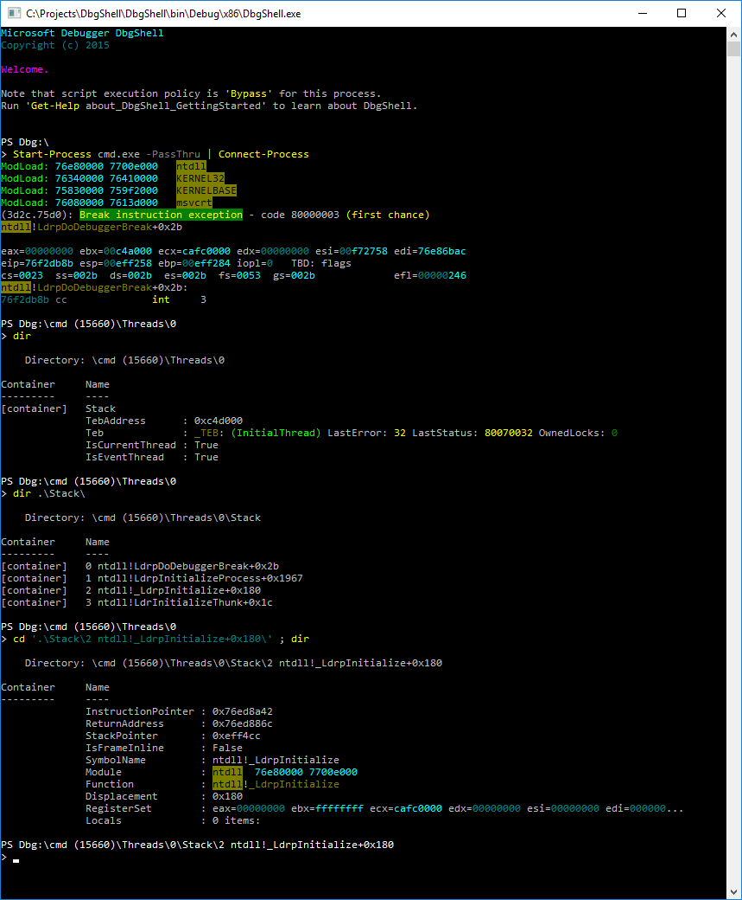
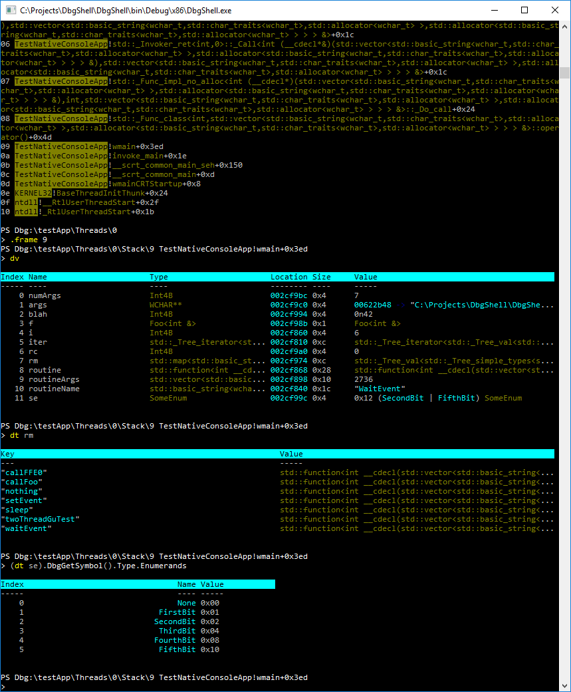

# DbgShell
A PowerShell front-end for the Windows debugger engine.

Ready to tab your way to glory? For a quicker intro, take a look at [Getting
Started](doc/GettingStarted.md).

## Disclaimers

1. This project is not produced, endorsed, or monitored by the Windows debugger team.
   While the debugger team welcomes feedback about their API and front ends (windbg, kd,
   et al), they have no connection with this project. Do not file bugs or feedback to the
   debugger team concerning this project.

2. This is not a funded project: it has no official resources allocated to it, and is only
   worked on by volunteers. Do not take any production dependency on this project unless
   you are willing to support it completely yourself. Feel free to file Issues and submit
   Pull Requests, but understand that with the limited volunteer resources, it may be a
   while before your submissions are handled.

3. This is an experimental project: it is not fully baked, and you should expect breaking
   changes to be made *often*.

Corollary of above disclaimers: I would avoid attaching DbgShell to live targets of high value.

## Binaries

[https://aka.ms/dbgshell-latest](https://aka.ms/dbgshell-latest)

## Motivation

Have you ever tried automating anything in the debugger? (cdb/ntsd/kd/windbg) How did that
go for you?

The main impetus for DbgShell is that it's just waaaay too hard to automate anything in
the debugger. There *are* facilities today to assist in automating the debugger, of
course. But in my opinion they are not meeting people's needs.
* Using the built-in scripting language is arcane, limited, difficult to get right, and
  difficult to get help with.
* Writing a full-blown debugger extension DLL is very powerful, but it's a significant
  investment—way too expensive for solving quick, "one-off" problems as you debug random,
  real-world problems. Despite the cost, there are a large number of debugger extensions
  in existence. I think there should not be nearly so many; I think the only reason there
  are so many is because there aren't viable alternatives.
* Existing attempts at providing a better interface (such as
  [PowerDbg](http://powerdbg.codeplex.com/)) are based on "scraping" and text parsing,
  which is hugely limiting (not to mention ideologically annoying) and thus are not able
  to fulfill the promise of a truly better interface (they are only marginally better, at
  best).
* Existing attempts to provide an easier way to write a debugger extension are merely a
  stop-gap addressing the pain of developing a debugger extension; they don't really solve
  the larger problem. (for instance, two major shortcomings are: they are still too
  low-level (you have to deal with the dbgeng COM API), and there's no REPL)
* The debugger team has recently introduce [Javascript
  scripting](https://docs.microsoft.com/en-us/windows-hardware/drivers/debugger/javascript-debugger-scripting).
  Javascript is a much better (and more well-defined) language than the old windbg
  scripting language, but I think that PowerShell has some advantages, the largest of
  which is that nobody really uses a Javascript shell--PowerShell is much better as a
  combined shell *and* scripting language.

**The goal of the DbgShell project is to bring the goodness of the object-based PowerShell
world to the debugging world.** When you do 'dt' to dump an 'object', you should get an
*actual* object. Scripting should be as easy as writing a PowerShell script.

The DbgShell project provides a PowerShell front-end for dbgeng.dll, including:
* a managed "object model" (usable from C# if you wished), which is higher-level than the
  dbgeng COM API,
* a PowerShell "navigation provider", which exposes aspects of a debugging target as a
  hierarchical namespace (so you can "cd" to a particular thread, type "dir" to see the
  stack, "cd" into a frame, do another "dir" to see locals/registers/etc.),
* cmdlets for manipulating the target,
* a custom PowerShell host which allows better control of the debugger CLI experience, as
  well as providing features not available in the standard powershell.exe host (namely,
  support for text colorization using ANSI escape codes (a la [ISO/IEC
  6429](http://en.wikipedia.org/wiki/ISO/IEC_6429)))

The custom host is still a command-line (conhost.exe-based) program (analogous to
ntsd/cdb/kd), but it can be invoked from windbg (`!DbgShell`).

In addition to making automation much easier and more powerful, it will address other
concerns as well, such as ease of use for people who don't have to use the debuggers so
often. (one complaint I've heard is that "when I end up needing to use windbg, I spend all
my time in the .CHM")

For seasoned windbg users, on the other hand, another goal is to make the transition as
seamless as possible. So, for instance, the namespace provider is not the only way to
access data; you can still use traditional commands like "`~3 s`", "`k`", etc.

## What do you mean by "automation" and "scripting"?
I'm not _only_ talking about the sort of thing where you open up a text editor and write
some big script to do something complex—I'm _also_ talking about being able to whip out
relatively simple stuff directly on the command line. There are many situations where you
would like to be able to use a little bit of logic, but nothing so big or re-usable that
you would even want to save it. It should be easy to just whip off "one-liners" like
"break on CreateFile if the file being opened is on the user's desktop and function Blah
is on the stack."

## Why PowerShell?

Let me be clear: it took me approximately 4 years to "warm up" to PowerShell. I feel it
has sharp edges, aspects that are just plain difficult, and plenty of bugs, both in design
and implementation. Sometimes it really irritates me. *However,* the benefits of
PowerShell are compelling, and have convinced me that it's the best thing to use for this
project:

* It is both a scripting environment and a CLI environment. The fact that it has to do
  both leads to some negative things like a steeper learning curve, but in the end it is
  extremely handy, because you want to be able to both do stuff quickly in a command-line
  REPL, as well as write full-featured, robust scripts.
* It is very discoverable—things like `Get-Command`, tab completion, the ability to expose
  hierarchical data like a filesystem, the facilities for providing and synthesizing help,
  are very good.
* Tab completion. I know I mentioned it in the previous bullet, but it's awesome enough to
  get its very own bullet.
* The object pipeline: the object-oriented nature of the PowerShell pipeline is so much
  more powerful and easy to use than the bad old days of string-parsing-based scripting
  that it's not even funny. Imagine doing "`dt`" to "dump" an "object", and actually
  getting an object. DbgShell does that.
* People know it: I estimate that the number of people who know PowerShell and/or C# is at
  least a handful of orders of magnitude larger than the people who know windbg scripting
  techniques. That means more people will be able to easily "pick up" a PowerShell-based
  debugger; and it also means that when people need help, the pool of potential helpers is
  much larger (for scripting-related issues, anyway).
* PowerShell is still a general-purpose shell: when using DbgShell, you have access to not
  just debugger commands, but you can "`cd`" over to the filesystem, registry, AD, etc.;
  you can execute `Send-MailMessage`, `Get-WmiObject`, `Invoke-WebRequest`,
  `Invoke-RestMethod`, run arbitrary programs, etc.

## Current Status

DbgShell has been in "prototyping mode" for a long time. I have spent a lot of time
figuring how something could or should be done, but not necessarily "finishing"
everything. There are a huge number of TODOs in the current code. So although it has
started to become actually useful, the project is still pretty green. However, it can
definitely demonstrate enough to give you a good taste of what it should be like.

Below are some screenshots. It's important to note that nothing you see is dbgeng text
output. Although some stuff in the output will look familiar, that is only because I have
used PowerShell's formatting and output features to customize how certain objects are
displayed—all the output you see actually corresponds to real, full .NET objects. For
instance, those ModLoad messages each correspond to a `MS.Dbg.ModuleLoadedEventArgs`
object, which has more properties than what get displayed when sent to `Out-Default`.
There is no string parsing of anything from dbgeng whatsoever. (Well... almost. I've made
a few compromises where there is no other way to get information. For instance,
disassembly stuff, or parsing the symbolic name of an adjustor thunk function to find the
offset.)

This is a sort of "hello world" scenario: attaching to an instance of cmd.exe. I first use
the PowerShell built-in command `Start-Process`, then pipe the output to the DbgShell
command `Connect-Process`, and then poke around the namespace:

Here I have attached to a test program, and looked at the stack, switched to a particular
stack frame, dumped locals, inspected the value of a local `std::map`, and inspected some
type information for a local enum value. Note the display of the enumeration value: not
only does DbgShell handle looking up the symbolic name for single enumerands, but also
when multiple enumerands are OR'ed together. You can't tell this from the screenshot, but
there is tab completion for all of this stuff.

## Notable Features
* [Color](doc/Color.md): support for text colorization using ANSI escape codes (a la
  [ISO/IEC 6429](http://en.wikipedia.org/wiki/ISO/IEC_6429))
* [Custom formatting engine](doc/CustomFormattingEngine.md): Don't like .ps1xml stuff? Me
  neither. In addition to standard table, list, and custom views, you can define
  "single-line" views which are very handy for customizing symbol value displays.
* [Custom symbol value conversion](doc/SymbolValueConversion.md): For most variables, the
  default conversion and display are good. But sometimes, you'd like the debugger to do a
  little more work for you. The symbol value conversion feature allows, for instance, STL
  collection objects to be transformed into .NET collection objects that are much easier
  to deal with.
* [Derived type detection](doc/DerivedTypeDetection.md): For when your variable is an
  IFoo, but the actual object is a FooImpl.
* [Rich type information](doc/RichTypeInfo.md): exposed for your programmatic pleasure.
* **Q:** Does it work in WinDbg? I will only use WinDbg. **A:** Yes--load up the
  DbgShellExt.dll extension DLL, and then run "`!dbgshell`" to pop open a DbgShell
  console.

## Current Deficiencies
* The biggest deficiency currently is that it does not support kernel mode well (if you
  are already in the proper context, you can display values, but you can't change context
  from within DbgShell, and the namespace is not wired up).
* Although you can load and execute traditional debugger extensions in the usual way,
  there are still many windbg commands missing.
* Remotes are not supported: the dbgeng API supports connecting to a remote debugger.
  Unfortunately, the symbol and type information exposed by the dbgeng API is critically
  insufficient for DbgShell's needs, so DbgShell uses the dbghelp API. Unfortunately,
  there is no such thing as remote dbghelp. We will need to work with the debugger team to
  solve this problem.

## License
Licensed under the [MIT](License.txt) License.

## Contributing

This project welcomes contributions and suggestions. Most contributions require you to
agree to a Contributor License Agreement (CLA) declaring that you have the right to, and
actually do, grant us the rights to use your contribution. For details, visit
https://cla.microsoft.com.

When you submit a pull request, a CLA-bot will automatically determine whether you need to
provide a CLA and decorate the PR appropriately (e.g., label, comment). Simply follow the
instructions provided by the bot. You will only need to do this once across all repos
using our CLA.

See [Contributing](Contributing.md) for more information about contributing to the project.

## Code of Conduct

This project has adopted the [Microsoft Open Source Code of
Conduct](https://opensource.microsoft.com/codeofconduct/).

For more information see the [Code of Conduct
FAQ](https://opensource.microsoft.com/codeofconduct/faq/) or contact
[opencode@microsoft.com](mailto:opencode@microsoft.com) with any additional questions or
comments.

## Other topics
* [Getting Started with DbgShell](doc/GettingStarted.md)
* [Color](doc/Color.md)
* [Custom formatting engine](doc/CustomFormattingEngine.md)
* [Custom symbol value conversion](doc/SymbolValueConversion.md)
* [Derived type detection](doc/DerivedTypeDetection.md)
* [Rich type information](doc/RichTypeInfo.md)

* [Hacking on DbgShell](Contributing.md)

* [DbgEngWrapper](doc/DbgEngWrapper.md)

You can find a short (3 minute) video introduction here: https://youtu.be/ynbg2zZ1Igc

