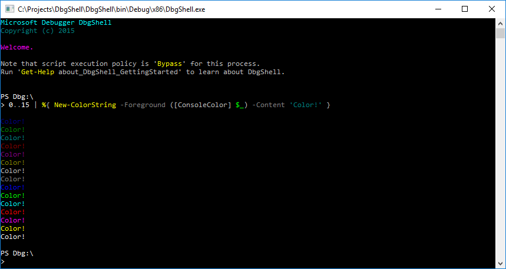
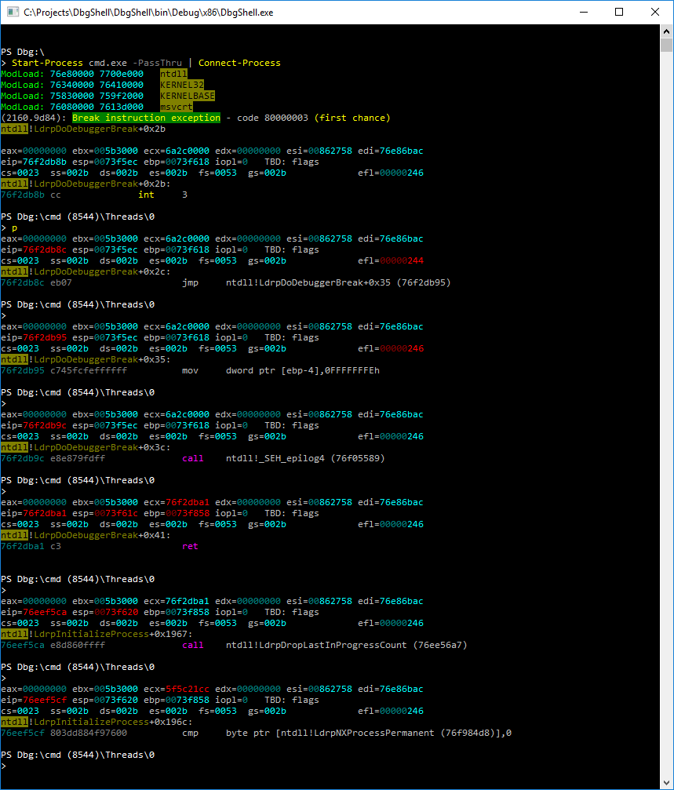

# Color

### ANSI escape codes
DbgShell.exe supports text colorization using ANSI escape codes (a la [ISO/IEC
6429](http://en.wikipedia.org/wiki/ISO/IEC_6429). Specifically, it supports a subset of
the SGR ("Select Graphics Rendition") codes, plus a pair of nonstandard "push" and "pop"
codes for better composability.

Of course you don't have to manually construct strings with all those icky escape codes;
use the `MS.Dbg.ColorString` class in C# or the `New-ColorString` command in PowerShell
script. The ColorString class has a fluent-style API, letting you do things like:

```powershell
$cs = (New-ColorString).Append( $sym.Type.ColorName ).
                        Append( ' ' ).
                        AppendPushPopFg( [ConsoleColor]::Green, $val.m_friendlyName ).
                        Append( ' ' ).
                        AppendPushFg( [ConsoleColor]::DarkGray ).
                        Append( '(Id ' ).
                        Append( $val.m_dwId.ToString() ).
                        Append( ')' ).
                        AppendPop()
```

Note that `ColorString` has implicit conversions from and to `System.String`, as well as
certain fields to make it "look like" `System.String`. This is to aid script use of
`ColorString` objects; the script is only interested in the content, and the color markup
is only for display by a capable host.




### ISupportColor
The `MS.Dbg.ISupportColor` interface has one method: `ToColorString()`, which returns a
`ColorString` object. DbgShell's [custom formatting and output
engine](CustomFormattingEngine.md) recognizes objects that implement this interface: if
you write an object to the output stream which implements `ISupportColor` (and there isn't
some other formatting view that covers it), the custom F+O will call `.ToColorString()` on
it for display.

## Why?

You've been staring at your debugger session for close to an hour... the numbers, the
acronyms, the addresses, the data, the instructions are all beginning to blend together...
your eyes are becoming bleary and tired trying to find the information you are looking for
in the sea of gray text...  Isn't there an easier way?

*There could be!*

With the help of _color_, seeing information can be a lot easier.

Of course the information is there in the text. But even a novice debugger does not read
through the debugger output like it was a novel&mdash;when debugging, *we look at the
output of the debugger like a picture to find the information that we really want to
read.* The ease or difficulty of finding the particular information has a huge impact on
the debugging experience.

With the current debugger, the only pictoral information that we have is shape and
texture&mdash;the texture of the text itself, and the shapes of the different types of
output. For instance, my eyes can pick out the shape of the "second chance!" message, the
shape of a stack dump, the shape of a modload or block of modloads, the shape of a data
dump, and the texture of chunks of zeros in a data dump. When stepping, I can rely on the
repeating constant shape of the register output displayed on each step to know where to
keep my eyes to see when a particular piece of information changes.

Color adds a whole new dimension to the information.

With the addition of color, you can highlight information independent of shape or within
shape. It can simply make a particular shape even more identifiable, or, even better, it
can highlight information within a shape. On top of that, even, it can highlight the
differences between two instances of the same shape.

For example, the register output is familiar to all who debug. It can be made even more
identifiable by making the register values blue. Even better, when stepping, if the
registers that change between each step change color, it becomes trivial to see what has
changed.




